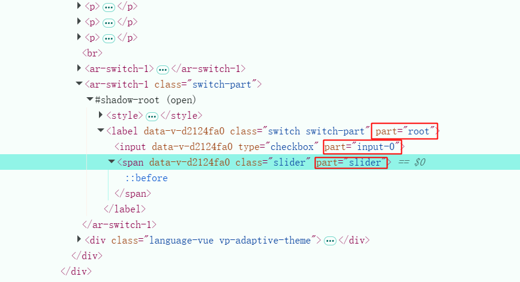

# 定制样式

由于`Web Components`具有 `Shadow DOM`的特性，普通的 CSS 无法直接穿透。

但`ArtoUI`依然提供了三种方式来自定义样式，帮助开发者灵活调整组件外观，以适应不同项目需求。

## 传递 CSS 变量

每个组件都提供了一些 CSS 变量。您可以在元素作用域中重定义这些变量，来调整组件宽高、色彩等。

<br/>

<ar-button-5>按钮 1</ar-button-5>
<ar-button-5 class="button2">按钮 2</ar-button-5>

<style>
.button2 {
  --color: rgb(34, 205, 221);
  --margin: 0 0 0 15px;
  --width: 300px;
}
</style>

```vue
<template>
  <ar-button-5>按钮1</ar-button-5>
  <ar-button-5 class="button2">按钮2</ar-button-5>
</template>

<style>
.button2 {
  --color: rgb(34, 205, 221);
  --margin: 0 0 0 15;
  --width: 300px;
}
</style>
```

## style 行内样式

与原生 style 属性一样，我们可以直接传递 style 标签属性。来改变组件的最外层容器样式

<br/>

<ar-button-3>按钮 1</ar-button-3>
<ar-button-3 style="margin-left:15px;width:300px">按钮 2</ar-button-3>

```vue
<template>
  <ar-button-3>按钮 1</ar-button-3>
  <ar-button-3 style="margin-left:15px;width:300px">按钮 2</ar-button-3>
</template>
```

## ::part 选择器

`::part` 选择器是现代浏览器都支持的一种，可以穿透`Shadow DOM`的 CSS 选择器。

这是最灵活的一种方式，您可以在 CSS 中，通过 `::part` 选中组件某个节点进行样式修改。

我们为组件内部所有元素都设置了不同的`part`属性，这意味着您可以通过`::part`去修改组件任意一个地方的样式，这比上面两种方式更加灵活！

<br/>

<ar-switch-1/>
<ar-switch-1 class="switch-part"/>

<style>
.switch-part::part(root) {
    margin-left:15px;
}

.switch-part::part(slider) {
    border-radius:10px;
}

.switch-part::part(slider)::before {
    border-radius:10px;
}
</style>


```vue
<template>
    <ar-switch-1/>
    <ar-switch-1 class="switch-part"/>
</template>

<style>
.switch-part::part(root) {
    margin-left: 15px;
}

.switch-part::part(slider) {
    border-radius: 10px;
}

.switch-part::part(slider)::before {
    border-radius: 10px;
}
</style>
```

<br/>

> 您可以在浏览器控制台里，找到对应元素，查看它的`part`属性

