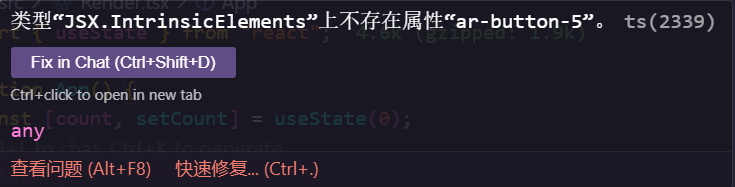

# tsx 文件的报错

在你使用 tsx 编写组件时，使用`Web Components`可能会遇到如下报错



## 解决方式

在你项目下任意一个 `.d.ts` 类型文件里，增加如下代码。

```ts
import type { HTMLAttributes } from "react";

declare module "react" {
  namespace JSX {
    interface IntrinsicElements {
      [key: string]: Record<string, any>;
    }
  }
}
```
